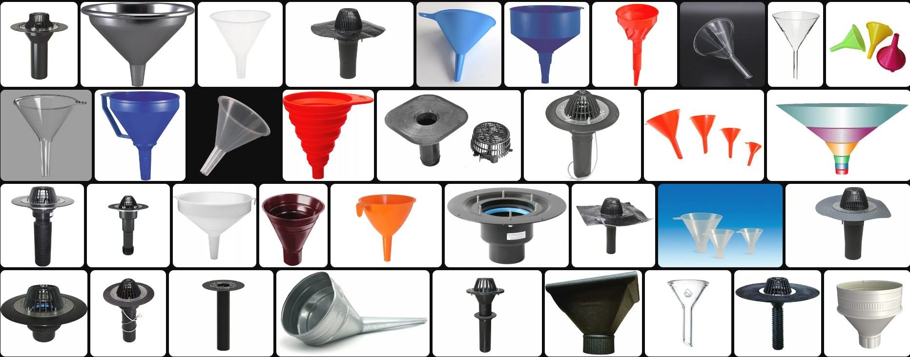

# laravel-easy-filter

Readme на других языках: [EN](https://github.com/mammothcoding/laravel-easy-filter)



[](https://packagist.org/packages/mammothcoding/laravel-easy-filter)
[](https://packagist.org/packages/mehdi-fathi/eloquent-filter)
[](https://github.com/mammothcoding/laravel-easy-filter/stargazers)
[](https://packagist.org/packages/mammothcoding/laravel-easy-filter)
[](https://github.com/mammothcoding/laravel-easy-filter.git)


## Содержание

- [Требования](#electric_plug-Требования)
- [Введение](#microphone-Введение)
- [Установка](#electric_plug-Установка)
- [Применение](#Применение)
  - [Простые примеры](#Простые-примеры)
  - [Все методы фильтрации](#Все-методы-фильтрации)
- [Методы](#Методы)
- [Лицензия](#Лицензия)

## :electric_plug: Требования
- PHP 7.4+
- Laravel 6.0+

## :microphone: Введение

Легкий фильтр и сортировщик index-подобных запросов и листингов моделей.
Возможно использование нескольких методов фильтрации в запросе и сортировки результата.

## :electric_plug: Установка

Следущая команда для установки через Composer:

        $ composer require mammothcoding/laravel-easy-filter

## Применение
Для применения понадобится сформировать правильный запрос к серверу и 
обработать его в нашем сервисе фильтрации с получением результат в удобном виде.

- #### Формат заголовков get-запроса:

***для фильтрации:***
```
    http://{адрес}/{путь}?filter=[["{имя поля}","{метод фильтрации}","{значение}"]]
```
***для сортировки:***
```
    http://{адрес}/{путь}?sort=[["{имя поля}","{asc/desc}"]]
```

### Простые примеры


- #### Пример обработки index-запроса на сервере для получения списка пользователей модели User в теле маршрута в /routes/web.php :
```php
use App\Models\User;
use Illuminate\Http\Request;
use Illuminate\Support\Facades\Route;
use Mammothcoding\LaravelEasyFilter\EasyFilter;

Route::get('/users', static function (Request $request) {
    $filter = new EasyFilter('App\Models\User', $request); // Создаем объект фильтра, указывая модель, передавая данные запроса
    $filter->filter(); // Применяем фильтр
    $filter->sort(); // Сортируем
    $result = $filter->getResultArray(); // Получаем результат сразу в виде массива
    return view('users', ['res' => $result]); // Возвращаем заранее подготовленный вид с результатом из контроллера
});
```


- #### Пример запроса на список модели с определенным значением одного поля:
```
http://0.0.0.0/users?filter=[["name","=","Armani Harber"]]
```
- #### Пример запроса на список модели с определенным окончанием в значении одного поля:
```
http://0.0.0.0/users?filter=[["email","endswith","gmail.com"]]
```
Действия в коде:
```php
namespace App\Http\Controllers;

use App\User;
use Mammothcoding\LaravelEasyFilter\EasyFilter;

class UsersController
{
    public function index()
    {
        $filter = new EasyFilter('App\Models\User', request()); // Создаем объект фильтра, указывая модель, передавая данные запроса
        $result = $filter->filter()->toArray(); // Применяем фильтр и преобразуем результирующую коллекцию в массив

        return view('users', ['$result' => $result]); // Возвращаем заранее подготовленный вид с результатом из контроллера
    }
}
```
- #### Пример запроса на список модели с несколькими методами фильтрации, сортировкой и пагинацией:
```
http://0.0.0.0/users?filter=[["email","endswith","gmail.com"],["created_at","<","2023-01-01"]]&sort=[["created_at","desc"]]&perpage=50
```

Действия в коде:
```php
namespace App\Http\Controllers;

use App\User;
use Mammothcoding\LaravelEasyFilter\EasyFilter;

class UsersController
{
    public function index()
    {
        $filter = new EasyFilter('App\Models\User', request()); // Создаем объект фильтра, указывая модель, передавая данные запроса
        $filter->filter(); // Применяем фильтр
        $filter->sort(); // Сортируем
        $result = $filter->getResultBuilder()
                ->paginate($this->request->input('perpage') ?? 1000)
                ->toArray();

        return view('users', ['$result' => $result]); // Возвращаем заранее подготовленный вид с результатом из контроллера
    }
}
```
- #### Пример запроса на список модели с фильтрацией и множественной сортировкой, сортировка будет применятся последовательно:
```
http://0.0.0.0/users?filter=[["created_at","<","2023-01-01"]]&sort=[["name","desc"],["created_at","desc"]]
```

Действия в коде:
```php
namespace App\Http\Controllers;

use App\User;
use Mammothcoding\LaravelEasyFilter\EasyFilter;

class UsersController
{
    public function index()
    {
        $filter = new EasyFilter('App\Models\User', request()); // Создаем объект фильтра, указывая модель, передавая данные запроса
        $filter->filter(); // Применяем фильтр
        $filter->sort(); // Сортируем
        $result = $filter->getResultArray(); // Забираем результат в виде массива

        return view('users', ['$result' => $result]); // Возвращаем заранее подготовленный вид с результатом из контроллера
    }
}
```


### Все методы фильтрации
Методы, указывающиеся 2-ым значением в массиве с правилом фильтрации:

Например: filter=[["created_at",`"<"`,"2023-01-01"]]

#
- ### ***Стандартные математические операторы сравнения***

=, <>, >, >=, <, <=

- ### ***in***

Выборка значений, присутствующих в указанных.

Например: `filter=[["groups","in",["medics","programmers"]]]`

- ### ***notin***

Выборка значений, не присутствующих в указанных.

Например: `filter=[["groups","notin",["medics","programmers"]]]`

- ### ***between***

Выборка значений из указанного промежутка.

Например: `filter=[["created_at","between",["2023-07-14T18:27:59.000000Z","2023-07-19T18:29:58.000000Z"]]]`

- ### ***notbetween***

Выборка значений, не входящих в указанный промежуток.

Например: `filter=[["created_at","notbetween",["2023-07-14T18:27:59.000000Z","2023-07-19T18:29:58.000000Z"]]]`

- ### ***startswith***

Выборка значений, начинающихся с указанного значения.

Например: `filter=[["created_at","startswith","2023-07-14"]]`

- ### ***endswith***

Выборка значений, заканчивающихся указанным значением.

Например: `filter=[["email","endswith",".com"]]`

- ### ***contains***

Выборка значений, содержащих указанное значение.

Например: `filter=[["name","contains","Dr."]]`

- ### ***notcontains***

Выборка значений, не содержащих указанного значения.

Например: `filter=[["name","notcontains","Dr."]]`


## Методы

Методы класса EasyFilter:

- ### ***filter()***

Добавляет в builder объекта условия фильтрации.

- ### ***sort()***

Добавляет в builder объекта условия сортировки.

- ### ***getResultBuilder()***

Получить результирующий builder объекта непосредственно как Eloquent Builder.

- ### ***getResultCollection()***

Получить результат из объекта как Collection.

- ### ***getResultArray()***

Получить результат из объекта в виде массива.

## Лицензия

[MIT](https://choosealicense.com/licenses/mit/)